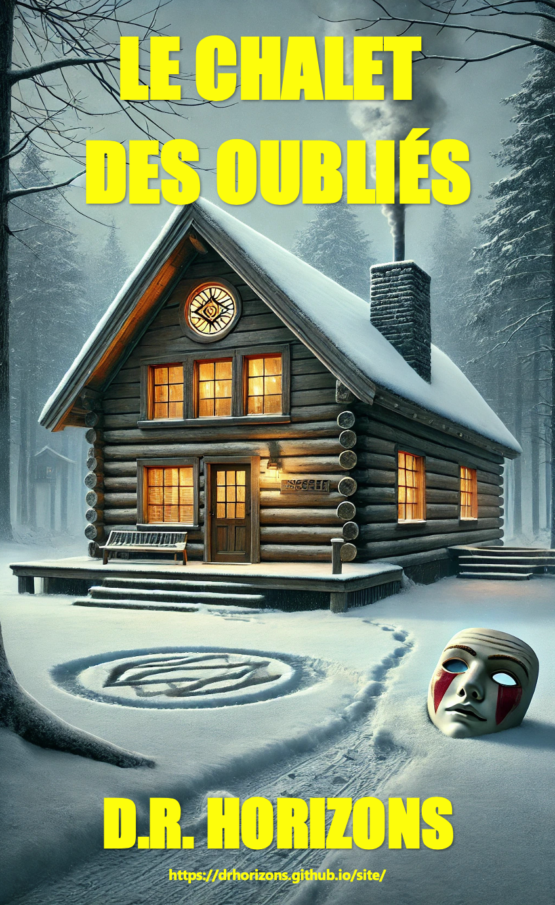

<!DOCTYPE html>
<html lang="fr">
    
<head>
    <meta charset="UTF-8">
    <meta name="viewport" content="width=device-width, initial-scale=1.0">
    <title>D.R. Horizons - Auteur</title>
    <meta name="description" content="Découvrez l'univers captivant de D.R. Horizons, écrivain de thrillers psychologiques et de récits mystérieux. Soutenez son œuvre littéraire.">
    <link rel="stylesheet" href="styles.css">
    
</head>
<body>
    

        <a href="#francais">Français</a> | <a href="#english">English</a>
    

    <header>
        
    </header>

    <nav>
        <a href="#oeuvres">Mon Livre</a>
        <a href="#about">À propos</a>
        <a href="#contact">Contact</a>
        <a href="#don">Soutenir</a>
    </nav>

    <section class="section" id="oeuvres">
        <h1>Mon premier livre</h1>
        
Après des vacances paradisiaques au Mexique, Chloé et Madison, deux amies inséparables, rentrent à Montréal, prêtes à reprendre leur routine. Mais une rencontre inattendue va bouleverser le cours des choses. Charles, un homme charismatique et mystérieux, croise le chemin de Chloé et l’invite à passer un week-end dans son vaste domaine enneigé du Vermont.

D’abord hésitante, Chloé accepte finalement l’invitation, rassurée par la présence de Madison et de son copain Kevin. Très vite, le trio se retrouve immergé dans un décor somptueux, entre le manoir imposant et un chalet plus intime, perdu en pleine nature. Charles, hôte attentif et raffiné, les accueille avec une générosité presque trop parfaite. Luxe, dîners élaborés, moments sous les étoiles… tout semble trop beau pour être vrai.

Mais alors que la nuit s’installe et que les ombres du passé refont surface, une tension étrange s’insinue dans l’atmosphère feutrée du chalet. Des regards appuyés, des silences lourds, des détails qui ne collent pas… Chloé commence à se demander si elle a eu raison d’accepter cette invitation. Que cache réellement Charles derrière son sourire énigmatique et ses attentions presque obsessionnelles ?

Alors que la neige recouvre le paysage d’un voile immaculé, la vérité, elle, s’apprête à éclater… et elle pourrait bien être plus glaçante que l’hiver lui-même.

        
        
Bientôt disponible. Plongez dans une œuvre captivante et hors du commun.

        <a href="https://www.amazon.com/dp/votre_livre" class="big-button">Acheter sur Amazon</a>
    </section>
    
    <section class="section" id="about">
        <h2>À propos</h2>
        
D.R. Horizons est un explorateur de l’imaginaire, un conteur aux mille facettes, porté par une soif d’aventure et une curiosité insatiable pour l’âme humaine. Écrivain atypique, il puise dans sa liberté de pensée et son goût pour la psychologie pour tisser des récits où le mystère flirte avec l’émotion, et où chaque détail a son importance. Installé à Montréal, une ville vibrante qui cultive l’ouverture d’esprit et la diversité des idées, il trouve dans ses rues, ses contrastes et son énergie créative une source d’inspiration inépuisable. L’écriture est pour lui une passion, un espace où il donne libre cours à son imagination débordante, façonnant des univers envoûtants où rien n’est jamais tout à fait ce qu’il semble être. 

    </section>
    
    <section class="section" id="contact">
        <h2>Contact</h2>
        <form id="contact-form">
            <label for="name">Nom :</label>
            <input type="text" id="name" name="name" required>
            <label for="email">Email :</label>
            <input type="email" id="email" name="email" required>
            <label for="message">Message :</label>
            <textarea id="message" name="message" rows="4" required></textarea>
            <button type="submit" class="big-button">Envoyer</button>
        </form>
    </section>
    
    <section class="section" id="don">
        <h2>Soutenez mon écriture</h2>
        
Écrire, c’est explorer, c’est donner vie à des mondes où le mystère, l’émotion et l’inattendu se rencontrent. Mon imagination déborde de projets – romans, récits captivants, et même des scénarios prêts à être portés à l’écran. Mais le temps me manque, partagé entre ma passion et mes obligations professionnelles.

Aujourd’hui, j’aimerais franchir un cap : me consacrer pleinement à l’écriture, donner à mes histoires l’espace qu’elles méritent, et peut-être même les voir prendre vie au cinéma. Votre soutien est bien plus qu’une aide financière : c’est un souffle, une impulsion qui me permet de continuer à créer, à publier, et à vous proposer des œuvres qui sortent des sentiers battus.

Si vous croyez en l’importance des récits qui transportent et questionnent, alors embarquez avec moi dans cette aventure littéraire et cinématographique. Chaque contribution est une pierre ajoutée à cet édifice d’imaginaire que nous bâtissons ensemble.

Merci infiniment pour votre soutien ! 

        <a href="https://paypal.me/DRHorizons?country.x=CA&locale.x=fr_CA" class="big-button">Faire un don</a>
    </section>
    
   
<!DOCTYPE html>
<html lang="en">
<nav>
    <a href="index.html">🇫🇷 French</a>
    <a href="index-en.html">🇬🇧 English</a>
</nav>

<head>
    <meta charset="UTF-8">
    <meta name="viewport" content="width=device-width, initial-scale=1.0">
    <title>D.R. Horizons - Author</title>
    <meta name="description" content="Discover the captivating universe of D.R. Horizons, a writer of psychological thrillers and mysterious tales. Support his literary work.">
    <meta name="keywords" content="Chalet of the Forgotten, D.R.H, DRH, D.R. Horizons, DR Horizons, Drhorizons, psychological thriller, dark thriller, horror thriller">
    <meta property="og:title" content="D.R. Horizons - Author">
    <meta property="og:description" content="Dive into the unsettling world of D.R. Horizons, where dreams and reality blur.">
    <meta property="og:image" content="cover.png">
    <meta property="og:url" content="https://drhorizons.github.io/D.R.H/">
    <link rel="canonical" href="https://drhorizons.github.io/D.R.H/">
    <link rel="stylesheet" href="styles.css">
    
</head>
<body>
    <header>
        
    </header>

    <nav>
        <a href="#works">My Book</a>
        <a href="#about">About</a>
        <a href="#contact">Contact</a>
        <a href="#support">Support</a>
    </nav>
    
    <section class="section" id="works">
        <h1>My First Book</h1>
        
After a dream vacation in Mexico, Chloe and Madison, two inseparable friends, return to Montreal, ready to resume their routine. But an unexpected encounter will change everything. Charles, a charismatic and mysterious man, crosses Chloe’s path and invites her to spend a weekend in his vast snow-covered estate in Vermont.

Initially hesitant, Chloe finally accepts the invitation, reassured by the presence of Madison and her boyfriend Kevin. Soon, the trio finds themselves immersed in a stunning setting, between the imposing manor and a more intimate chalet, lost in nature. Charles, an attentive and refined host, welcomes them with almost too-perfect generosity. Luxury, elaborate dinners, moments under the stars... everything seems too good to be true.

But as night falls and shadows of the past resurface, a strange tension creeps into the cozy atmosphere of the chalet. Intense gazes, heavy silences, details that don’t add up... Chloe begins to wonder if she made the right choice. What is Charles really hiding behind his enigmatic smile and almost obsessive attentions?

As the snow blankets the landscape in a pristine veil, the truth is about to be revealed... and it might be more chilling than winter itself.

        
        
Coming soon. Dive into a captivating and unique work.

        <a href="https://www.amazon.com/dp/your_book" class="big-button">Buy on Amazon</a>
    </section>
    
    <section class="section" id="about">
        <h2>About</h2>
        
D.R. Horizons is an explorer of the imagination, a storyteller with many facets, driven by a thirst for adventure and an insatiable curiosity about the human soul. An unconventional writer, he draws on his freedom of thought and love of psychology to weave stories where mystery flirts with emotion, and where every detail matters. Living in Montreal, a vibrant city that fosters open-mindedness and diverse ideas, he finds in its streets, contrasts, and creative energy an inexhaustible source of inspiration. Writing is his passion, a space where he gives free rein to his overflowing imagination, shaping mesmerizing universes where nothing is ever quite what it seems. 

    </section>
    
    <section class="section" id="contact">
        <h2>Contact</h2>
        <form id="contact-form">
            <label for="name">Name:</label>
            <input type="text" id="name" name="name" required>
            
            <label for="email">Email:</label>
            <input type="email" id="email" name="email" required>
            
            <label for="message">Message:</label>
            <textarea id="message" name="message" rows="4" required></textarea>
            <button type="submit" class="big-button">Send</button>
        </form>
    </section>
    
    <section class="section" id="support">
        <h2>Support My Writing</h2>
        
Writing is about exploring, bringing to life worlds where mystery, emotion, and the unexpected meet. My imagination is overflowing with projects – novels, gripping stories, and even screenplays ready to hit the big screen. But time is scarce, split between my passion and professional obligations.

Today, I want to take a step further: dedicate myself fully to writing, give my stories the space they deserve, and maybe even see them come to life in film. Your support is more than financial help: it’s a breath of encouragement that allows me to keep creating, publishing, and offering you stories that break the mold.

If you believe in the power of stories that transport and challenge, then join me on this literary and cinematic adventure. Every contribution is a brick added to this imaginative world we are building together.

Thank you so much for your support! 

        <a href="https://paypal.me/DRHorizons?country.x=CA&locale.x=en_CA" class="big-button">Make a Donation</a>
    </section>
    
    <footer>
        © 2025 D.R. Horizons - A Writer Without Limits
    </footer>
</body>
</html>

            <h3>Welcome to D.R. Horizons' Website</h3>
            
Explore my captivating stories and support my literary work.

        </section>
        
© 2025 D.R. Horizons - Un écrivain hors limites

    </footer>

    
</body>
</html>
