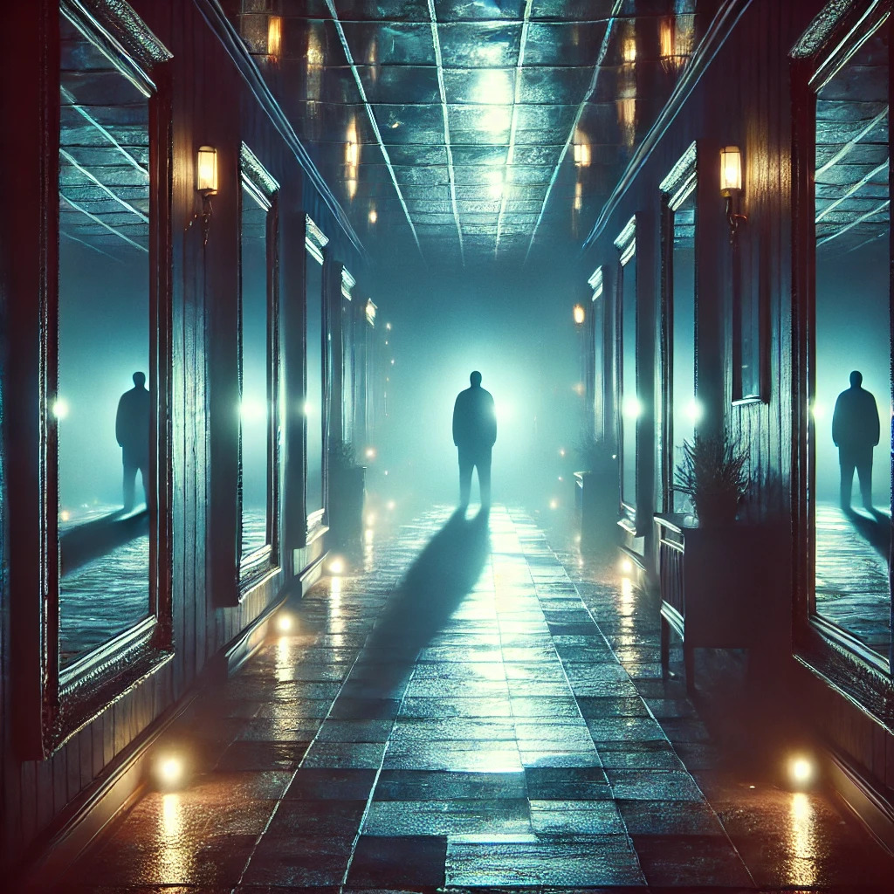
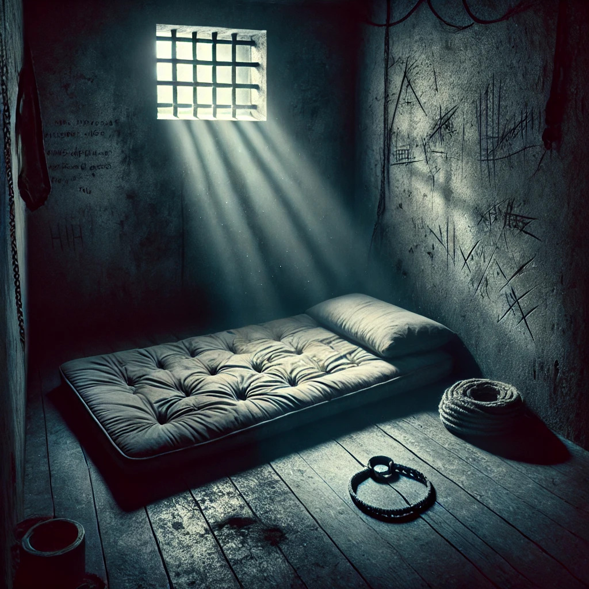

<html lang="fr">
<head>
    <meta charset="UTF-8">
    <meta name="viewport" content="width=device-width, initial-scale=1.0">
    <title>D.R. Horizons - Auteur</title>
    <meta name="description" content="Découvrez l'univers captivant de D.R. Horizons, écrivain de thrillers psychologiques et de récits mystérieux. Soutenez son œuvre littéraire.">
    <meta name="keywords" content="Thriller psychologique, Roman Thriller, Thriller au Vermont, Chalet des oubliés, Roman Chalet, Roman séquestration, Suspense intense, Roman à suspense, Mystère psychologique, Thème de la domination">
    <link rel="stylesheet" href="styles.css">
    
    <link href="https://fonts.googleapis.com/css2?family=Dancing+Script:wght@400;700&display=swap" rel="stylesheet">
</head>
<body>
    

        
        

            D.R. Horizons est un explorateur de l’imaginaire, un conteur aux mille facettes, porté par une soif d’aventure et une curiosité insatiable pour l’âme humaine. Écrivain atypique, il puise dans sa liberté de pensée et son goût pour la psychologie pour tisser des récits où le mystère flirte avec l’émotion, et où chaque détail a son importance. 
             
            Installé à Montréal, une ville vibrante qui cultive l’ouverture d’esprit et la diversité des idées, il trouve dans ses rues, ses contrastes et son énergie créative une source d’inspiration inépuisable. 
        

    

    <nav>
        <a href="#oeuvres">Oeuvres</a>
        <a href="#contact">Contact</a>
        <a href="#don">Soutenir</a>
        <a href="blog.html">Blog</a>

    </nav>
    <section class="section" id="oeuvres">
        <h1>Mon premier livre</h1>
        
Après des vacances paradisiaques au Mexique, Chloé et Madison, deux amies inséparables, rentrent à Montréal, prêtes à reprendre leur routine. Mais une rencontre inattendue va bouleverser le cours des choses. Charles, un homme charismatique et mystérieux, croise le chemin de Chloé et l’invite à passer un week-end dans son vaste domaine enneigé du Vermont.
         

D’abord hésitante, Chloé accepte finalement l’invitation, rassurée par la présence de Madison et de son copain Kevin. Très vite, le trio se retrouve immergé dans un décor somptueux, entre le manoir imposant et un chalet plus intime, perdu en pleine nature. Charles, hôte attentif et raffiné, les accueille avec une générosité presque trop parfaite. Luxe, dîners élaborés, moments sous les étoiles… tout semble trop beau pour être vrai.
 
Mais alors que la nuit s’installe et que les ombres du passé refont surface, une tension étrange s’insinue dans l’atmosphère feutrée du chalet. Des regards appuyés, des silences lourds, des détails qui ne collent pas… 
 
Alors que la neige recouvre le paysage d’un voile immaculé, la vérité, elle, s’apprête à éclater… et elle pourrait bien être plus glaçante que l’hiver lui-même.

        
        
Plongez dans une œuvre captivante et hors du commun.

        <a href="https://www.amazon.fr/dp/votre-lien-ici" class="buy-button">Commander sur Amazon</a>

       <title>Notation</title>
    

<html lang="fr">
<head>
    <meta charset="UTF-8">
    <meta name="viewport" content="width=device-width, initial-scale=1.0">
    <title>Notation</title>
    
</head>
<body>

    

        ☆
        ☆
        ☆
        ☆
        ☆
    

    
Moyenne des évaluations : 0/5

    <textarea id="rating-comment" class="rating-comment" rows="2" placeholder="Laissez un court commentaire..."></textarea>
    <button onclick="submitRating()">Envoyer</button>

<h3>Meilleurs commentaires :</h3>

</body>
</html>
<section class="section" id="Blog">
    <h2>Derniers articles du Blog</h2>
    

        <article class="blog-card">
            
            <h3>Pourquoi les thrillers psychologiques nous fascinent ?</h3>
            
Les thrillers psychologiques jouent avec notre esprit et nos émotions. Mais pourquoi sommes-nous tant attirés par ces récits haletants ?

            <a href="blog.html" target="_blank">Lire la suite</a>
        </article>

        <article class="blog-card">
            
            <h3>Le roman de séquestration : un genre captivant</h3>
            
Des histoires sombres et claustrophobes qui nous plongent dans l'esprit des captifs et de leurs bourreaux... Analyse du genre.

            <a href="blog.html" target="_blank">Lire la suite</a>
        </article>

    

</section>

    <h2>Contact</h2>
    <form id="contact-form" action="https://formspree.io/f/moveaedn" method="POST">
        <label for="name">Nom :</label>
        <input type="text" id="name" name="name" required>

        <label for="email">Email :</label>
        <input type="email" id="email" name="email" required>

        <label for="message">Message :</label>
        <textarea id="message" name="message" rows="4" required></textarea>

        <input type="hidden" name="_captcha" value="false">

        <button type="submit" class="big-button">Envoyer</button>
    </form>
</section>
    
    <section class="section" id="don">
        <h2>Donnez vie à mes histoires</h2>
        
 ✨
Écrire, c’est explorer, donner naissance à des mondes où le mystère, l’émotion et l’inattendu se rencontrent. Mon imagination déborde de projets – romans, récits captivants, et même des scénarios prêts à être portés à l’écran. Mais pour leur donner l’espace qu’ils méritent, j’ai besoin de votre soutien.
 

Chaque contribution est une impulsion précieuse qui me permet de me consacrer pleinement à l’écriture, de publier plus régulièrement et de partager avec vous des histoires qui sortent des sentiers battus.
 
🎁 En guise de remerciement, vous aurez accès à des contenus exclusifs. 
 
Si vous croyez en l’importance des récits qui transportent et questionnent, embarquez avec moi dans cette aventure littéraire et cinématographique.
 
Merci infiniment pour votre soutien ! ❤️📚

        <a href="https://paypal.me/DRHorizons?country.x=CA&locale.x=fr_CA" class="big-button">Faire un don</a>
  <section id="english">

    <footer>
        
&copy; 2025 - Tous droits réservés.

    </footer>

